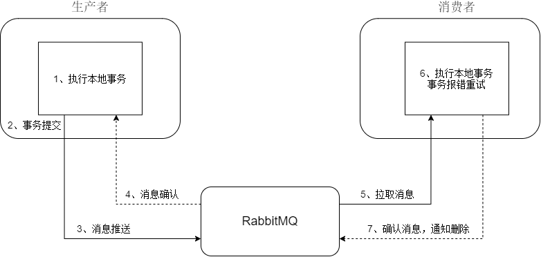

## 基于RabbiMQ的分布式事务Demo

一个简单的基于rabbitMQ的分布式事务demo程序，在极端情况下存在消息丢失的风险，没有保证强一致性。

#### 原理图

该流程一致性保证会比较弱，在一些情况下，存在消息的丢失，需要人工介入。

**如何保证消息100%被投递到rabbitMq**

利用rabbitMq的确认机制，当生产者发送消息后，如果成功投递到ack确认，如果没有收到该消息，则进行消息重传，重试次数为5次

**如何保证消费者100%接受到消息**

利用rabbitMq的手动确认机制，当本地事务执行完成后会回传手动确认收到消息；对于没有消费成功的事务，rabbitMq会将消息重传给另一个副本中执行，如果代码逻辑没有问题，一般很小概率会执行失败，即使一直执行，由于是利用协程执行，不会影响其他消息的处理；

**如何避免重复消费**

消费者成功消费消息后，会将事务ID记录到redis中，当同一条消息被消费时候会直接退出并删除消息；

#### 可能出现的异常情况

**1、无法推送消息到消息服务**

网络断开，超出五次重试后业务回滚；

**2、消息已经推送到rabbitMq中，确认过程出错**

如果RabbitMQ因为自身内部错误导致消息丢失或无法成功处理，ack为false，进行重试；如果10s之内仍然无法收到确认，进行重试，重试失败，事务回滚；

等待时间需要设置相对长一些，如果时间过短，消息已经推送成功，但是来不及接受确认就进行重试操作，会导致消息发送失败，会严重影响一致性；

**3、消息到达后，rabbitMq服务挂掉了**

对消息进行持久化，服务重启后，消息不会丢失

**4、消费者消费消息失败**

业务逻辑出错，消费者未消费消息，消息一直是未确认状态，会重新发送直至消息消费成功，重试有上限，会有人工兜底

**5、消费者消费消息后确认失败**

可能网络原因，重新拉取消息，有幂等保证，不会重复消费事务

#### 待验证问题

以下问题需要讨论：

1、是否有必要设置死信队列，对于长时间没有确认的消息放入死信队列中，有后台线程对其重新拉取；

2、是否有必要加入本地消息表，对消息进行持久化；

3、在生产者中，将事务和消息发送放在一个事务中，一起成功，一起失败，是否比分开更好；

### Used
gorm

go-redis

rabbitMq