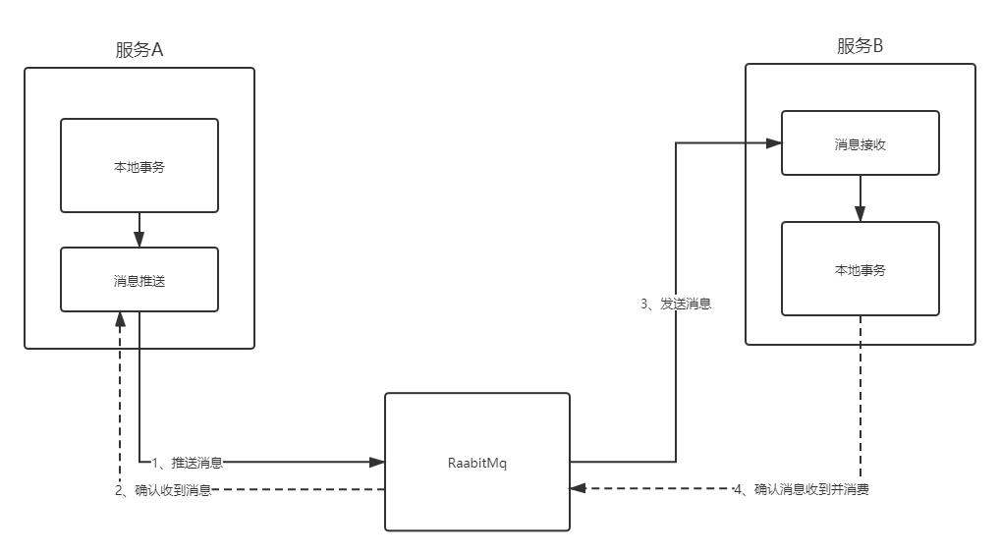
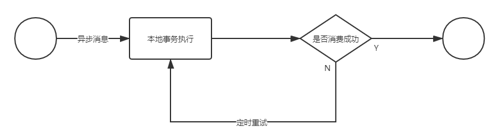

## 基于RabbiMQ的分布式事务Demo

一个简单的基于rabbitMQ的分布式事务demo程序，在极端情况下存在消息丢失的风险，没有保证强一致性

### 原理

基于rabbitmq的分布式事务的主要解决以下两个问题：

1、如何保证消息100%被送到rabbitMq

利用rabbitMq的确认机制，当生产者发送消息后，会回传一个ack确认，没有收到该消息，则进行消息重传；

2、如何保证消费者100%的接收到消息并消费

利用手动消息确认，可以保证事务一定会被接受消息并消费，对于没有消费成功的事务，可以选择重传或者其它逻辑处理；消费端利用redis进行幂等处理，保证同一条消息只被处理一次

### 事务补偿机制

在消费者收到消息以后，在执行本地事务的时候出错，消息仍然会确认，但是会启动一个协程去将该消息落库，并进入死循环不断重试直到成功为止

### 后期计划
尽量保证做成强一致性